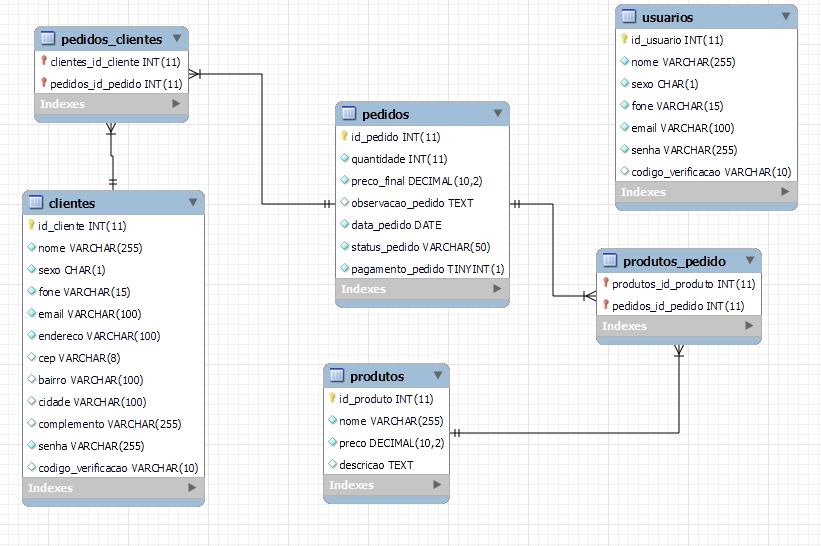
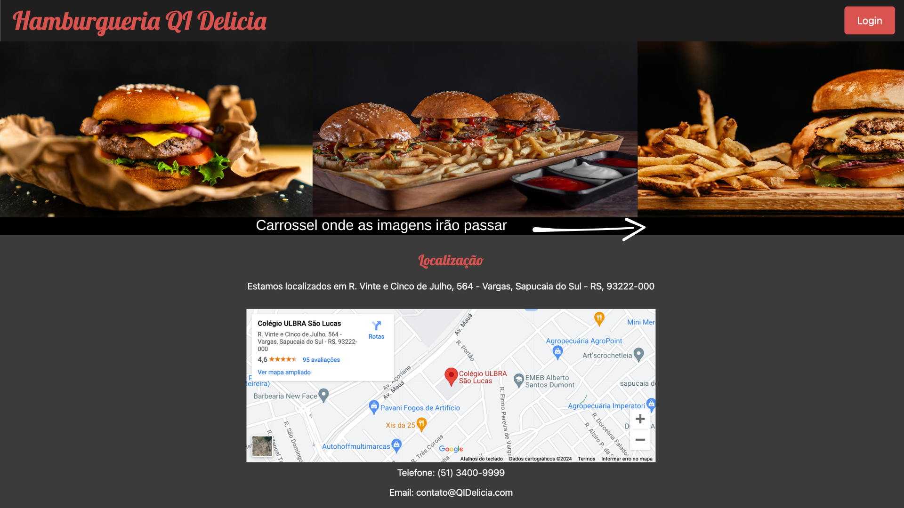
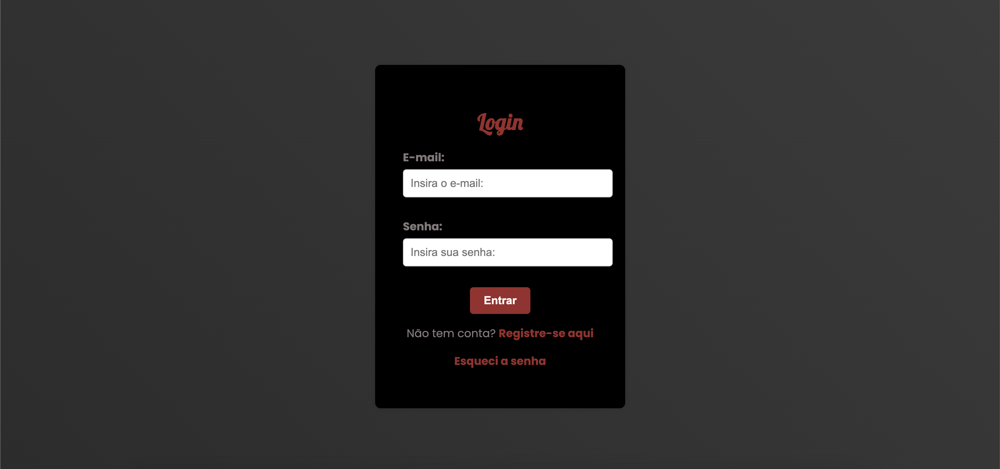
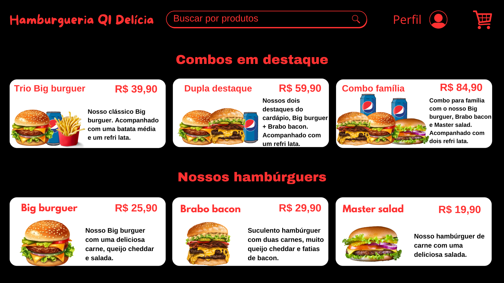

# ProjetoWebIII - Site de Delivery

Bem-vindo ao repositório do meu projeto final para a matéria de web III. O projeto visa criar, inicialmente, 3 cruds como foi proposto pelo professor orientador. O grupo idealizador do trabalho optou por criar um site com a proposta de trazer um Delivery online, com opção de cadastrar usuários, produtos e clientes. Também buscamos adicionar o cardápio para que o cliente consiga fazer esse pedido.

## Conteúdo

- [Visão Geral](#visão-geral)
- [Ideia Inicial](#ideia-inicial)
- [Funcionalidades](#funcionalidades)
- [Estrutura do Projeto](#estrutura-do-projeto)
- [Tecnologias Utilizadas](#tecnologias-utilizadas)
- [Como Usar](#como-usar)  
- [Realizadores do Projeto](#realizadores-do-projeto)
- [Contribuição](#contribuição)


## Visão Geral

O site vai ser designado inicialmente para completar as tarefas que o professor solicitou, com funcionalidades dos cruds e, posteriormente, a responsividade para que o site consiga rodar tanto no computador quanto mobile. Abaixo você pode verificar as primeiras realizações do grupo, como criar DER para organizar as ideias:



## Ideia Inicial 

Inicialmente o projeto foi pensado para que tenha uma tela de index onde irá mostrar informações da empresa, como localizacão, sobre a empresa, a quanto tempo no mercado e também vai conter um carrosel onde passará as imagens de hamburgueres com algumas decrições.



Abaixo também criamos um exemplo feito no Canvas e no próprio VSCode de como será as telas de Login e quando o cliente estiver logado para verificar os produtos que temos disponíveis em nosso delivery. 




## Funcionalidades:

- **Cadastro e Login de Usuários:** Sistema de autenticação para acesso ao portal para gerenciar clientes e produtos.
- **Gerenciamento de Produtos:** CRUD para criação, atualização e deleção de produtos.
- **Gerenciamento de Clientes:** CRUD para criação, atualização e deleção de clientes.
- **Gerenciamento de Pedidos:** CRUD para clientes fazerem pedidos em nosso sistema.
- **Conexão com Banco de Dados:** Integração com MySQL para armazenamento e recuperação de dados.

## Estrutura do Projeto

- `index.php`: Página inicial do site.
- `css/`: Diretório contendo os arquivos CSS.
- `imagens/`: Diretório para armazenar imagens do site.
- `classes/`: Diretório contendo as classes de Database, Produtos, Clientes e Usuários.
- `config/`: Diretório para conexão com o banco de dados.
- `header&footer/`: Diretório para armazenar as headers e footers do site.

## Tecnologias Utilizadas

- **PHP:** Linguagem de programação utilizada para o back-end.
- **MySQL:** Banco de dados utilizado para armazenar informações.
- **HTML/CSS:** Estrutura e estilo da interface do usuário/clientes/produtos.
- **Bootstrap:** Framework web utilizado para desenvolvimento de componentes de interface e front-end.


## Como Usar

1. Clone o repositório:

   ```bash
   git clone https://github.com/Princeofskyy/ProjetoWebIII.git

2. Execute o script create_tables:
```
- No projeto contém um arquivos chamado "dump.sql" onde você pode copiar o script e colar no seu servidor MySQL.
```
3. Configure a conexão com o banco de dados:
```
- Edite o arquivo `config/config.php` com as credenciais do seu banco de dados.
```
4. Acesse o localhost:
```
- Entre em seu navegador e digite: `localhost/nome-do-projeto`
- Cadastre-se e faça login com as credenciais de usuário.
- Use as funcionalidades disponíveis.
```
5. Acessos:
   
Para acessar o login do cliente (principal) você pode acessar no botão "login" do index.php ou pode seguir o caminho:
```
`localhost/nome-do-projeto/login_cliente.php`
```
Para acessar o login do Usuário (que controla Clientes, Usuários e Produtos) você pode acessar pelo caminho:
```
`localhost/nome-do-projeto/login.php`
```
  
### Realizadores do Projeto.

O projeto foi pensado e elaborado em grupo, conforme as atividades que o professor passou em aula, composto por:

- [**Gabriel Costa**](https://github.com/Princeofskyy)
- [**Gustavo Brasil**](https://github.com/gustavobrasilm)
- [**João Mendes**](https://github.com/joaomendesp)


### Contribuição

Contribuições são bem-vindas! Sinta-se à vontade para sugerir melhorias em design, funcionalidades e qualquer comentário referente ao site.

---

© 2024 Gabriel. Todos os direitos reservados.


